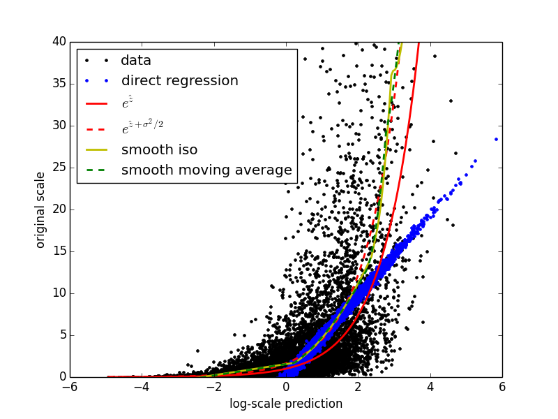

Transformations and consequences
================================

.. author:: default
.. categories:: python, statistics
.. tags:: transformation, calibration
.. comments::

.. epigraph::

	He knows she tried to be forgiving, but who can just shrug away a guilty lie, 
	a stab in the back? Such a mistake will change a relationship irreversibly, 
	even if we have learned from the mistake and would never repeat it.

	-- In game text from Braid

Today I want to talk about mistakes.  No, not mistakes, really.  A mistake is something we regret, something with lingering consequences, like when you work too much on a laptop and get a painful neck spasm that lasts the rest of the week.  A mistake is an action that, if we had the chance to go back and try again, we would do differently.  But there are some actions that we regret, whose consequences linger painfully, but that we wouldn't do differently even if we somehow had the chance.  In either case we limp along as best we can, trying to compensate for that which is irretrievably lost.  

I'm alluding, of course, to the Box-Cox transformation, and, more generally, to all those nonlinear monotonic transformations which may be applied to a response variable in a regression problem to make the regression perform better.  These kinds of transformations can sometimes mark the difference between a model that is quite predictive and one that is over fit and not at all predictive on the testing set.  The problem, of course, is that once you build your model on the transformed response variable, it becomes difficult to make predications on the original response scale.  One can't simply apply the inverse of the original transformation to the predictions and expect everything to be fine.  Everything will not be fine.  Today I want to talk about what happens after the nonlinear monotonic transformation.  It wasn't a mistake.  It's just a mess, but we're in this mess together.

Let's say we've got some response :math:`y` and a nonlinear monotonic transformation :math:`f\left(\right)`.  Let's have :math:`z=f\left(y\right)` and say we have some pretty good predictor :math:`\hat{z}` of :math:`E\left(z\right)`.  Firstly, what makes this predictor pretty good?  How can we compare it to some other predictor, :math:`\hat{y}`, that we built for :math:`E\left(y\right)` on the original scale?  It's a popular practice to use the coefficient of determination, :math:`R^2`, to assess the predictive power of a regression model, but :math:`R^2` is very sensitive to nonlinear transformations.  A better idea in this context is to use a rank based measure of predictive power, such as Spearman's :math:`\rho` or Kendall's :math:`\tau`.  These metrics will not be influenced by any monotonic transformation.  I also like to compare :math:`R^2` between the training set and a reserved testing set for my regression models.  Often I will find extreme overfitting on the original response scale while the model I fit on the transformed response shows good generalization.

So we've assessed predictiveness and generalization for our models, and the best one is :math:`\hat{z}`.  Great.  Now we have a real mess to clean up.  We have a model for :math:`E\left(f\left(y\right)\right)` and we want a model for :math:`E\left(y\right)`.  We've know :math:`f\left(y\right)`, and since it's monotonic we can presumably find the inverse :math:`f^{-1}\left(z\right)=y`.  However, :math:`E\left(f\left(y\right)\right)\ne f\left(E\left(y\right)\right)` in general, so it is also not generally true that :math:`f^{-1}\left(E\left(f\left(y\right)\right)\right) = E\left(y\right)`.  In fact it is usually false.  Super false.  It turns out that this data transformation problem is similar to another problem about which a group of scientists in La Jolla has recently published a few short articles: risk model calibration.  I stumbled upon their publications recently when I was researching the topic of this post :cite:`Jiang2011`:cite:`Jiang2011a`:cite:`Wu2012`.  The problems are essentially identical: given a predictive model with good rank-based performance (area under the ROC curve in the case of classifiers, Spearman's :math:`\rho` or Kendall's :math:`tau` in the case of regression problems with numeric response), find a transformation such that the output of that model accurately predicts the expected value of the quantity of interest.  Generally, a monotonic transformation is desired so that the rank-based performance is preserved, but one of the three methods described by the lab in question actually gives a transformation that is not strictly monotonic.  I don't want to describe the methods in detail here.  The papers I cited are freely available online.  I mostly just want to share a few methods I implemented that are very similar (and were inspired by these scientists' fine work).

An example
-----------------

To start with, let's look at an extremely simplified example.  First I'm going to simulate a simple regression problem with a lognormal response distribution.

.. code:: python

	import numpy
	from matplotlib import pyplot
	from calibrators import SmoothIso, SmoothMovingAverage, spearman, kendall
	numpy.random.seed(0)

	# Generate some fake data with a lognormal distribution
	m = 10000
	n = 10
	sigma = 1.0
	X = numpy.random.normal(size=(m,n))
	beta = 2.0 * numpy.random.binomial(1,.5,size=n) * numpy.random.uniform()
	eta = numpy.dot(X, beta)
	mu = eta
	y = numpy.random.lognormal(mean=mu, sigma=sigma, size=m)

Next, I'm going to fit a linear regression model to the simulated data on the log scale.  

.. code:: python

	# Do a linear regression on the log of the data
	z = numpy.log(y)
	beta_hat = numpy.linalg.lstsq(X, z)[0]
	z_hat = numpy.dot(X, beta_hat)

The goal now is to find a way to go from :code:`z_hat` back to some estimate of :code:`y`.  Of course we could have just done linear regression on the data scale directly, like this.

.. code:: python

	# Try doing linear regression directly
	beta_hat_direct = numpy.linalg.lstsq(X, y)[0]
	y_hat = numpy.dot(X, beta_hat_direct)

	# Compare the two models
	rho = spearman(y, z_hat)
	rho_direct = spearman(y, y_hat)
	tau = kendall(y, z_hat)
	tau_direct = kendall(y, y_hat)
	print 'rho is %f for the log model and %f for the direct model' % (rho, rho_direct)
	print 'tau is %f for the log model and %f for the direct model' % (tau, tau_direct)
	# rho is 0.802388 for the log model and 0.800836 for the direct model
	# tau is 0.606838 for the log model and 0.605232 for the direct model

In this case, the difference in rank-based performance between the two models is not significant.  I just wanted to show how the comparison might be made.  When using more complex nonparametric methods, data scale has a significant effect on generalization ability of the fitted models.  With linear regression on this particular problem, overfitting is not really an issue.  Now I want to try out some different ways of reversing the log transformation on the predictions.  First, I'm going to try using the obvious and wrong inverse, :math:`\hat{y} = e^{\hat{z}}`.  It turns out that for this particular problem, where the data have a known lognormal distribution, the exact right answer is known.  That is, it is a provable fact that :math:`E\left(y\right) = e^{E\left(z\right) + \frac{\sigma^2}{2}}`, where :math:`\sigma` is the known scale parameter of the lognormal distribution.  I will use this result as a basis for comparison.  Next, I'm going to use the two methods I implemented, SmoothIso (based on the idea from :cite:`Jiang2011a`) and SmoothMovingAverage (based more loosely on the idea from :cite:`Jiang2011`).  Finally, I'll plot the results together to see how they compare.

.. code:: python

	# Range for plotting calibration curves
	z_range = numpy.arange(z_hat.min(), z_hat.max(), .05)

	# Try reversing the log by inversion
	y_hat_inv = numpy.exp(z_range)

	# Try reversing the log by the actual correct formula
	y_hat_correct = numpy.exp(z_range + (sigma**2)/2.0)

	# Try reversing the log using SmoothIso
	smooth_iso = SmoothIso(max_degree=2).fit(z_hat, y)
	y_hat_si = smooth_iso.predict(z_range)

	# Try reversing the log using SmoothMovingAverage
	moving_average = SmoothMovingAverage(max_degree=2).fit(z_hat, y)
	y_hat_sma = moving_average.predict(z_range)

	# Plot the different reversal attempts
	lw = 2
	pyplot.plot(z_hat, y, 'k.', label='data', lw=lw)
	pyplot.plot(z_hat, y_hat, 'b.', label='direct regression', lw=lw)
	pyplot.plot(z_range, y_hat_inv, 'r', label='$e^{\hat{z}}$', lw=lw)
	pyplot.plot(z_range, y_hat_correct, 'r--', label='$e^{\hat{z} + \sigma^{2}/2 }$', lw=lw)
	pyplot.plot(z_range, y_hat_si, 'y', label='smooth iso', lw=lw)
	pyplot.plot(z_range, y_hat_sma, 'g--', label='smooth moving average', lw=lw)
	pyplot.ylim(0,40)
	pyplot.legend(loc=0)
	pyplot.savefig('example.png', transparent=True)
	pyplot.show()

Here is the resulting plot.

Final thoughts
--------------

The plot illustrates nicely that simply inverting the original transformation is a very bad idea.  On this data set both the calibration methods stick near the correct (dotted red) curve.  What's nice about this, of course, is that both the calibration methods are purely data driven, and work just as well in situations in which the exact distribution of the data is either not convenient or not known, or even in situations in which the original transformation is unknown.

So, how does all this work?  Well, the exact details are beyond the scope of this particular blog entry, but generally speaking SmoothIso works by performing isotonic regression followed by MARS, and SmoothMovingAverage works by training a MARS model on a moving average of the training data.  I encourage you to read the articles and check out my implementations.  I'm putting all the code used in this post, including the calibrators themselves, in a `github repository`_.  I hope you'll try it out.

.. _github repository: https://github.com/jcrudy/calibrators

.. bibliography:: denorm.bib
